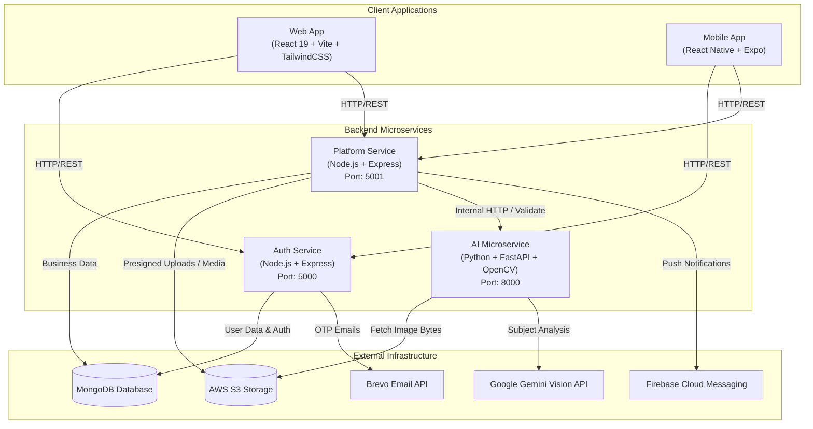
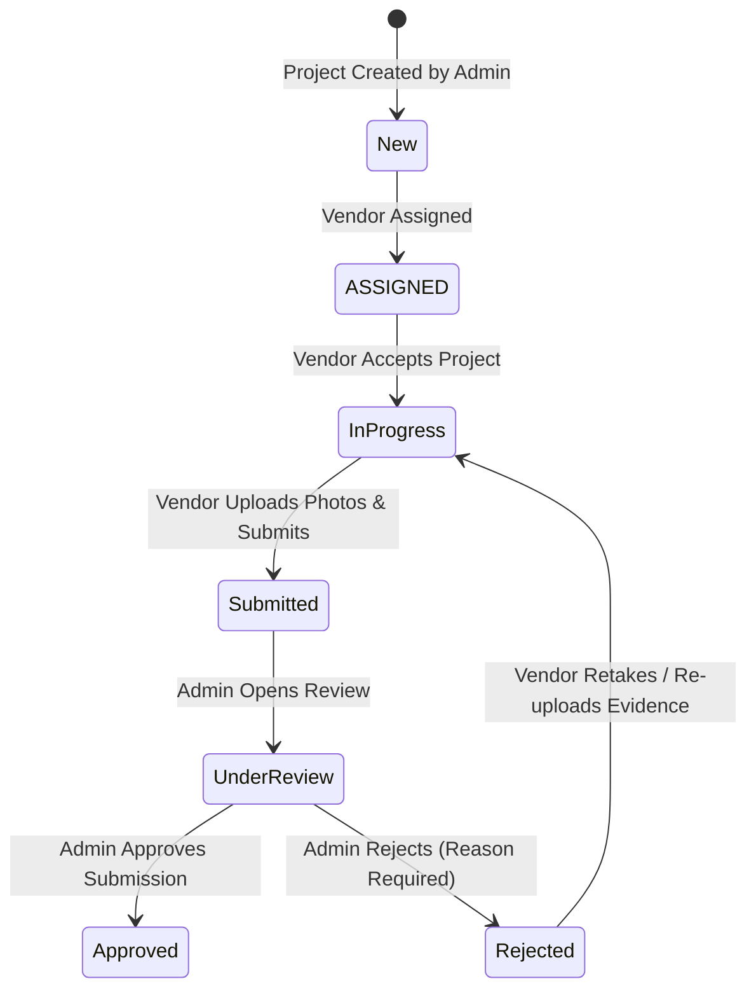

# FieldCam

An enterprise field-work management, site inspection, and AI-assisted proof-of-work validation platform.

---

## Table of Contents

- [Overview](#overview)
- [Why FieldCam?](#why-fieldcam)
- [Key Features](#key-features)
- [System Architecture](#system-architecture)
- [Application Components](#application-components)
- [Technology Stack](#technology-stack)
- [Core User Roles](#core-user-roles)
- [Authentication & Authorization](#authentication--authorization)
- [Project Management Flow](#project-management-flow)
- [Vendor Workflow](#vendor-workflow)
- [Mobile Photo Capture Flow](#mobile-photo-capture-flow)
- [AI Photo Validation](#ai-photo-validation)
- [Project Submission Flow](#project-submission-flow)
- [Notifications](#notifications)
- [Backend Architecture](#backend-architecture)
- [Database & Storage](#database--storage)
- [API Architecture](#api-architecture)
- [Web Application](#web-application)
- [Mobile Application](#mobile-application)
- [AI Microservice](#ai-microservice)
- [Security](#security)
- [Deployment Architecture](#deployment-architecture)
- [Project Structure](#project-structure)
- [Local Development](#local-development)
- [Environment Variables](#environment-variables)
- [Testing](#testing)
- [Current Status](#current-status)
- [Future Improvements](#future-improvements)

---

## Overview

**FieldCam** is an end-to-end field-work management and project inspection platform designed for enterprise operations. It connects field administrators, project managers, and vendors/contractors in a single synchronized ecosystem.

With FieldCam:
- **Administrators** create services, configure required photo checklists, manage vendor assignments, review field submissions, monitor financial invoices, and maintain audit trails.
- **Vendors and Field Staff** manage assigned projects via web and mobile interfaces, capture geotagged inspection evidence on site, review photos locally, and submit completed proof-of-work.
- **Automated AI Quality & Subject Validation** acts as a verification gate—evaluating photo clarity, lighting exposure, and subject category alignment before project submission is permitted.
- **Backend Submission Gates** enforce strict business rules (checklist completion, AI validation pass status, GPS geofence proximity, and capture timestamp freshness) to prevent fraudulent or low-quality site submissions.
- **Push Notification Infrastructure** keeps stakeholders immediately informed about assignment changes, submission reviews, approval decisions, and support updates.

> **Note:** FieldCam uses AI as an assisting validation layer within a broader human-in-the-loop operational framework—not as an autonomous decision maker.

---

## Why FieldCam?

Field operations often suffer from poor verification mechanisms, missing site evidence, location spoofing, delayed submission reviews, and fragmented communication between administrators and field workers.

FieldCam solves these operational challenges by introducing:
1. **Deterministic Verification Gates**: Automated checks ensure photos are clear, appropriately lit, geotagged at the true job site, and captured within valid timeframes.
2. **Offline-First Capture Session**: Photos taken in the mobile app are held in a local capture session for preview, retake, or deletion before any network upload occurs.
3. **AI-Assisted Subject Audit**: Computer vision checks that uploaded photos match the specific inspection category expected by the project owner.
4. **Decoupled Microservice Architecture**: Dedicated microservices handle authentication, core domain operations, and AI vision analysis independently.
5. **Real-Time Visibility**: Instant push notifications and comprehensive audit logs keep project managers informed at every stage of execution.

---

## Key Features

### Authentication & Identity Management
- **Role-Based Access Control**: Strict access boundaries across `SUPER_ADMIN`, `ADMIN`, `VENDOR`, and `STAFF`.
- **Stateless JWT Tokens**: Standard Bearer token authentication across all API endpoints.
- **Multi-Factor Registration & Recovery**: Email OTP verification for account activation, profile completion, and password resets.
- **Web & Mobile Portals**: Tailored login flows for management web dashboard and field mobile applications.
- **Protected Routes & Identity Interceptors**: Automatic token injection and 401 handling across Axios client instances.

### Project & Service Management
- **Lifecycle Status Tracking**: Comprehensive project state progression (`New` → `ASSIGNED` → `In Progress` → `Submitted` → `Under Review` → `Approved` / `Rejected`).
- **Service Template Engine**: Define service categories, baseline pricing, workflow rules, and required photo checklists.
- **Vendor Assignment**: Assign specific vendors to project locations with automatic push notification delivery.
- **Project Activity & Audit Logs**: Immutable audit log of all status transitions, photo uploads, photo deletions, and review actions.

### Vendor & Field Operations
- **Vendor Dashboard**: Real-time project overview, active job metrics, earnings breakdown, and status counters.
- **Interactive Checklists**: Category-based inspection requirements with progress indicators.
- **In-App Messaging & Notes**: Collaborative project notes shared between vendors and operational administrators.
- **Support System**: Integrated support ticketing with priority levels, status tracking, and project linking.
- **Financial Invoicing**: Invoice tracking, status updates (`Draft`, `Pending`, `Paid`, `Overdue`), and payment overview.

---

## System Architecture



---

## Application Components

| Component | Directory | Description |
|---|---|---|
| **Auth Service** | `backend/auth-service/` | Node.js / Express microservice managing credentials, user registration, JWT generation, password resets, and OTP email dispatch. |
| **Platform Service** | `backend/platform-service/` | Node.js / Express microservice handling core business domain (projects, services, vendors, photos, invoices, support, push notifications, and audit logs). |
| **AI Microservice** | `ai-service/` | Standalone Python FastAPI service performing OpenCV image quality checks and Google Gemini Vision category verification. |
| **Web Application** | `web-app/` | React 19 single-page management application built with Vite, TailwindCSS v4, React Router v7, and Recharts. |
| **Mobile Application** | `mobile-app/` | React Native / Expo iOS and Android mobile app equipped with native camera integration, GPS acquisition, local capture sessions, and push notifications. |

---

## Technology Stack

### Backend Services
- **Runtime**: Node.js (ES Modules)
- **Framework**: Express.js
- **Database ODM**: Mongoose (MongoDB)
- **Authentication**: `jsonwebtoken`, `bcryptjs`
- **Cloud Storage SDK**: `@aws-sdk/client-s3`, `@aws-sdk/s3-request-presigner`
- **Push & Email**: `firebase-admin`, `@getbrevo/brevo`
- **Validation**: `express-validator`

### AI Microservice
- **Language**: Python 3.13
- **Framework**: FastAPI + Uvicorn
- **Image Processing**: OpenCV (`opencv-python`), Pillow (`PIL`), NumPy
- **Vision Model Integration**: `google-genai` SDK
- **Data Validation & HTTP**: Pydantic v2, `httpx`
- **Testing**: `pytest`

### Web Application
- **Library**: React 19
- **Build Tool**: Vite 8
- **Styling**: TailwindCSS v4
- **Routing**: React Router DOM v7
- **Icons & Charts**: React Icons, Recharts
- **HTTP Client**: Axios

### Mobile Application
- **Framework**: React Native 0.81 with Expo SDK 54
- **Navigation**: Expo Router v6 (File-based navigation)
- **Language**: TypeScript 5.9
- **Hardware Integrations**: `expo-camera`, `expo-location`
- **Notifications**: `expo-notifications`, `@react-native-firebase/messaging`
- **Storage**: `@react-native-async-storage/async-storage`

---

## Core User Roles

| Role | Access Scope & Description |
|---|---|
| `SUPER_ADMIN` | Full system access across all organizational data, administrative configurations, analytics, and service templates. |
| `ADMIN` | Management interface access to create projects, assign vendors, review submissions, issue invoices, manage support tickets, and view audit logs. |
| `VENDOR` | External contractor account with access to assigned project feeds, mobile photo capture, local review session, submission execution, performance statistics, and invoice tracking. |
| `STAFF` | Internal field staff member role defined within user identity schemas for organizational assignment. |

---

## Authentication & Authorization

Authentication is decoupled between identity verification and business operations:

1. **Identity & Token Issuance (`auth-service`)**:
   - Handles password hashing via `bcryptjs`.
   - Issues signed JSON Web Tokens (JWT) containing `id`, `email`, and `role`.
   - Sends email OTPs via Brevo for email registration verification and password reset requests.

2. **Decoupled Verification (`platform-service`)**:
   - The Platform Service does not store passwords or process credentials.
   - It independently verifies incoming HTTP `Authorization: Bearer <token>` headers using a shared `JWT_SECRET`.
   - Enforces role-based permission middleware (`protect`, `authorize("ADMIN")`, etc.) across protected API routes.

> **Note:** The system uses stateless JWT access tokens. There are no refresh token or session management flows currently implemented.

---

## Project Management Flow



1. **Creation**: Admin creates a project referencing an active `Service` template.
2. **Assignment**: Vendor is assigned; system notifies vendor via push notification; status transitions to `ASSIGNED`.
3. **Acceptance**: Vendor accepts the project on mobile or web; status transitions to `In Progress`.
4. **Field Execution**: Vendor captures evidence for all required checklist categories.
5. **Submission Gate**: Backend validates required photos, AI status (`PASSED`), GPS distance, and timestamp age before setting status to `Submitted`.
6. **Review & Audit**: Admin evaluates submitted work in the web review portal, approving or rejecting with constructive feedback.

---

## Vendor Workflow

1. **Receive Assignment**: View new work on mobile dashboard or web portal.
2. **Accept Job**: Move project to `In Progress` status.
3. **Open Capture Session**: Select a required checklist item category on the mobile app.
4. **Capture Evidence**: Take photo with automatic geotagging and timestamping.
5. **Local Review**: Review captured photos locally; replace via **Retake** or delete via **Delete** without network calls.
6. **Batch Upload**: Upload session photos to S3 and trigger AI microservice analysis.
7. **AI Verification**: View AI analysis status (`PASSED`, `FAILED`, `PENDING`).
8. **Submit Work**: Execute final submission to send project to `Submitted` status for admin review.

---

## Mobile Photo Capture Flow

Photos captured in the mobile application are subject to a multi-stage local session management flow before network upload occurs:

```
Category Selection
        ↓
  Capture Photo (Camera + GPS + Timestamp)
        ↓
 Local Preview (Stored in Local App State)
        ↓
 Retake / Delete / Add More Categories
        ↓
 Upload Photos (Batch Multipart Upload to Backend)
        ↓
 AI Verification (Backend calls AI Service)
        ↓
 Submit Photo (Verification Review Screen)
        ↓
 Submission Confirmation Modal
        ↓
 Backend Validation Gate (Checklist + AI + GPS + Timestamp)
        ↓
 Work Submitted (Project Status -> Submitted)
```

### Local Session Rules

- **Photos are NOT uploaded immediately upon capture.** Captures are held locally in `sessionPhotos` state.
- **Retake**: If the user selects Retake on a category, the camera opens for that category. Capturing a new image automatically replaces the local image for that category without making an HTTP request to the backend.
- **Delete**: Deleting a local photo removes it from `sessionPhotos` and marks the category incomplete locally. No backend delete API call is triggered.
- **Batch Upload**: Only when the user taps **Upload Photos** are images transmitted to S3 storage via the Platform Service.

---

## AI Photo Validation

The standalone **AI Microservice** (`ai-service`) executes automated quality and content verification on uploaded site images:

### Analysis Pipeline

1. **Clarity Analysis (OpenCV)**:
   - Evaluates image sharpness using **Laplacian variance**.
   - Threshold: `laplacian_var >= 100.0`.
   - Produces a normalized clarity score ($0.0 \dots 1.0$).

2. **Lighting Analysis (NumPy)**:
   - Calculates mean image luminance across color channels.
   - Detects **underexposed** (< 40.0) or **overexposed** (> 215.0) lighting conditions.
   - Normalizes lighting score ($0.0 \dots 1.0$).

3. **Subject / Category Verification (Google Gemini Vision)**:
   - Transmits image bytes and expected category label to **Google Gemini Vision API** (`gemini-1.5-flash`).
   - Prompts Gemini to evaluate whether the image visually corresponds to the expected category name.
   - Parses structured JSON response containing `passed`, `confidence`, `detectedDescription`, and `reason`.

### Combined Status Logic

A photo's overall validation result is evaluated as:

$$\text{passed} = \text{clarity.passed} \land \text{lighting.passed} \land (\text{subject.passed} \equiv \text{True})$$

- If all three checks pass, status is set to **`PASSED`**.
- If clarity, lighting, or subject check fails, status is set to **`FAILED`**.
- If the Vision API key is not configured or an error occurs during execution, status is set to **`PENDING`**.

---

## AI Service API

### Endpoint: `POST /validate-photo`

**Headers**:
- `X-Internal-Service-Key`: Shared internal secret header for service-to-service security.

**Request Schema**:
```json
{
  "imageUrl": "https://fieldcam-project-media.s3.ap-south-2.amazonaws.com/images/sample.jpg?X-Amz-Algorithm=...",
  "expectedCategory": "Foundation & Site Drainage"
}
```

**Response Schema**:
```json
{
  "success": true,
  "passed": true,
  "clarity": {
    "passed": true,
    "score": 0.85,
    "metric": "laplacian_variance",
    "laplacianVariance": 425.12
  },
  "lighting": {
    "passed": true,
    "score": 1.0,
    "meanLuminance": 128.4,
    "issues": []
  },
  "subject": {
    "passed": true,
    "confidence": 0.95,
    "expectedCategory": "Foundation & Site Drainage",
    "detectedDescription": "Exposed concrete foundation footing with perimeter gravel drainage channel",
    "reason": "Image clearly shows concrete foundation and site drainage elements as specified.",
    "status": "SUCCESS"
  }
}
```

---

## Project Submission Flow

Before moving a project to `Submitted` status, the backend executes strict submission gating in `project.service.js`:

```
Platform Service (submitVendorProject)
                  │
                  ├── 1. Check Vendor Ownership & Project Status (must be "In Progress")
                  │
                  ├── 2. Verify Photo Evidence (Every checklist category must have photo)
                  │
                  ├── 3. Verify AI Validation Status (Every photo MUST have aiValidation.status == "PASSED")
                  │
                  ├── 4. Verify GPS Location (Photo coordinates must be within 500m geofence of project)
                  │
                  ├── 5. Verify Timestamp (Photo capturedAt must be within 24h & not in future)
                  │
     ┌────────────┴────────────┐
   FAIL                       PASS
     │                          │
Reject Request             Update Status -> "Submitted"
HTTP 400 Bad Request       Log Audit Event (PROJECT_SUBMITTED)
Return validationErrors    Return Updated Project
```

If any check fails, submission is rejected with HTTP `400 Bad Request` and an explicit list of failed requirements.

---

## Notifications

FieldCam utilizes **Firebase Cloud Messaging (FCM)** and **Expo Notifications** for multi-device push notifications:

- **Token Registration**: Mobile devices register active FCM tokens via `POST /api/notifications/device-token`.
- **Multicast Push Delivery**: Backend push service uses `firebase-admin/messaging` to deliver high-priority push notifications across all active registered devices for a user.
- **Stale Token Cleanup**: Invalid or unregistered device tokens returned by FCM are automatically deactivated in MongoDB.
- **In-App Notification Center**: Persisted notification documents track read/unread state and support mark-as-read actions via `/api/notifications` routes.

---

## Backend Architecture

```
backend/
├── auth-service/
│   ├── server.js              # Entrypoint & environment loader
│   ├── index.js               # Express application setup
│   └── src/
│       ├── config/            # Database connection setup
│       ├── middleware/        # JWT protect & error handling middleware
│       ├── modules/
│       │   └── auth/          # Auth controller, model, routes, service, validation
│       ├── services/          # Brevo email integration service
│       └── utils/             # Helper utilities
│
└── platform-service/
    ├── server.js              # Entrypoint & environment loader
    ├── index.js               # Express app & route mounting
    ├── credentials/           # Firebase Admin SDK private key configuration
    └── src/
        ├── config/            # DB, Firebase Admin, and AWS S3 initialization
        ├── middleware/        # JWT middleware, S3 Multer upload handler, validator
        ├── modules/           # Analytics, Audit, Dashboard, Invoice, Notification,
        │                      # Project, Service, Support, Users, Vendor modules
        ├── services/          # AI Microservice client & AWS S3 client
        └── utils/             # Haversine GPS & timestamp validation utilities
```

---

## Database & Storage

### MongoDB (Mongoose Schemas)

FieldCam utilizes MongoDB as its primary database. Primary domain models include:

- **User**: User identity, role (`SUPER_ADMIN`, `ADMIN`, `VENDOR`, `STAFF`), password hash, OTP metadata, and user profile fields.
- **Project**: Core project document containing project metadata, client info, vendor ID, status, checklist items, photos array (with embedded `aiValidation` subdocument), attachments array, and notes array.
- **Service**: Service templates defining category, pricing, rules, and required checklist items.
- **Vendor**: Vendor profiles storing company details, contact info, ratings, and associated user ID.
- **Invoice**: Invoice records with invoice items, total amounts, due dates, and payment statuses (`Draft`, `Pending`, `Paid`, `Overdue`).
- **Support Ticket**: Helpdesk tickets with subject, description, priority (`Low`, `Medium`, `High`, `Urgent`), status (`Open`, `In Progress`, `Resolved`, `Closed`), and optional project reference.
- **Notification**: Notification log tracking user ID, title, body, notification type, data payload, and read status.
- **DeviceToken**: Device registration store keeping FCM tokens, device platform info, and active status.
- **AuditLog**: Immutable system audit trail capturing actor, action, entity type, entity ID, description, and metadata.

### AWS S3 Storage

Media assets and project documents are stored in Amazon S3:
- Images are uploaded to the `images/` prefix folder in S3.
- Attachments are uploaded to the `attachments/` prefix folder.
- **Presigned URLs**: Access to private S3 media is provided via short-lived AWS S3 presigned GET URLs generated on demand by the Platform Service.

---

## API Architecture

| Service | Protocol | Base Path | Port (Local) | Port (Render) |
|---|---|---|---|---|
| **Auth Service** | HTTP / REST | `/api/auth` | 5000 | Dynamic (`PORT`) |
| **Platform Service** | HTTP / REST | `/api` | 5001 | Dynamic (`PORT`) |
| **AI Service** | HTTP / REST | `/` | 8000 | Dynamic (`PORT`) |

### Key API Endpoint Summary

#### Auth Service (`/api/auth`)
- `POST /send-registration-otp` - Dispatch registration OTP email.
- `POST /verify-registration-otp` - Verify email registration OTP.
- `POST /complete-profile` - Complete user profile registration.
- `POST /login` - Web portal login (returns JWT).
- `POST /mobile/login` - Mobile app login (returns JWT).
- `POST /forgot-password` - Trigger password reset OTP email.
- `POST /verify-reset-otp` - Verify password reset OTP.
- `POST /reset-password` - Reset account password with valid OTP.
- `GET /me` - Retrieve authenticated user profile.
- `PUT /me` - Update authenticated user profile.

#### Platform Service (`/api`)
- `GET /projects` - List projects with status, vendor, and search filters.
- `POST /projects` - Create new project with optional initial media.
- `GET /projects/:id` - Get detailed project document with presigned media URLs.
- `PUT /projects/:id` - Update project details or assigned vendor.
- `PATCH /projects/:id/status` - Update project status (e.g. approve/reject).
- `POST /projects/:id/accept` - Vendor accepts assigned project.
- `POST /projects/:id/photos` - Upload vendor photo for checklist item.
- `DELETE /projects/:id/photos/:photoId` - Delete vendor photo from project.
- `POST /projects/:id/submit` - Submit project for admin review (triggers gating).
- `GET /projects/:id/notes` - Get project notes.
- `POST /projects/:id/notes` - Add note to project.
- `GET /services` - List service templates.
- `POST /services` - Create service template.
- `GET /vendors` - List vendor profiles.
- `POST /vendors` - Create vendor profile.
- `GET /invoices` - List invoices.
- `POST /invoices` - Create invoice.
- `GET /support` - List support tickets.
- `POST /support` - Create support ticket.
- `GET /notifications` - Retrieve user notification history.
- `POST /notifications/device-token` - Register FCM device token.
- `DELETE /notifications/device-token` - Deactivate FCM device token.
- `GET /audit-logs` - Retrieve system audit trail.

---

## Web Application

The **FieldCam Web Application** (`web-app/`) provides management dashboards for Super Admins, Admins, and Vendors:

- **Technology**: React 19, Vite 8, TailwindCSS v4, React Router v7, Recharts, React Icons, Axios.
- **Admin Dashboards**: Real-time project overview, vendor performance metrics, monthly submission charts, revenue analytics, and recent activity logs.
- **Project Review Portal**: Comprehensive submission review interface allowing admins to inspect uploaded photos, examine AI verification scores, view geotag locations, read vendor notes, and approve or reject submissions with comments.
- **Vendor Portal**: Web interface for vendors to review assigned jobs, monitor payment invoices, submit support tickets, and track approval ratings.

---

## Mobile Application

The **FieldCam Mobile Application** (`mobile-app/`) is built specifically for field workers and vendors executing site inspections:

- **Technology**: React Native 0.81, Expo SDK 54, TypeScript 5.9, Expo Router v6.
- **Native Camera Interface**: Custom camera screen built with `expo-camera` supporting flash control, camera flip, category guidance overlay, and real-time geotag preview.
- **GPS Acquisition**: High-accuracy GPS location capture powered by `expo-location`.
- **Local Review & Batch Upload**: Multi-photo preview screen supporting photo retakes, deletions, and batch upload to S3.
- **AI Verification Screen**: Interactive breakdown displaying clarity, lighting, and subject match results for each captured photo.
- **Push Notification Support**: Foreground notification handling via `expo-notifications` and background push registration via `@react-native-firebase/messaging`.

> **Note:** The mobile application is pure React Native + Expo (TypeScript). It does not use native Kotlin source modules.

---

## AI Microservice

The **AI Microservice** (`ai-service/`) operates as an independent FastAPI microservice:

- **Technology**: Python 3.13, FastAPI, Uvicorn, OpenCV (`opencv-python`), Pillow, NumPy, `google-genai`, Pydantic v2, `httpx`, `pytest`.
- **Sharpness Evaluation**: OpenCV Laplacian variance algorithm with a $100.0$ blur threshold.
- **Luminance Evaluation**: Grayscale luminance distribution analysis detecting underexposed (< 40.0) or overexposed (> 215.0) frames.
- **Subject Categorization**: Direct integration with Google Gemini Vision API (`gemini-1.5-flash`) using structured JSON response mode.
- **Security**: Protected by `X-Internal-Service-Key` header authentication to ensure only authorized Platform Service requests can invoke analysis.

---

## Security

FieldCam implements multi-layered security controls:

1. **Authentication**: Stateless JWT token authentication across all protected API routes.
2. **Password Security**: Passwords hashed using `bcrypt` with a salt factor of 10.
3. **Role Authorization**: Role checking middleware (`SUPER_ADMIN`, `ADMIN`, `VENDOR`) prevents unauthorized API access and data leakage.
4. **Service-to-Service Security**: Internal communication between Platform Service and AI Microservice is authorized using a pre-shared secret key (`X-Internal-Service-Key`).
5. **Private Media Access**: AWS S3 bucket objects are private; media is accessed exclusively through short-lived presigned GET URLs.
6. **Input Validation**: Request bodies and parameters are validated using `express-validator` (Node.js) and `Pydantic` (Python).
7. **Secret Isolation**: Configuration secrets and API keys are loaded via environment variables and excluded from Git repositories via `.gitignore`.

---

## Deployment Architecture

FieldCam is configured for cloud deployment on **Render**, **AWS**, and **MongoDB Atlas**:

```
                  ┌─────────────────────────────────────────┐
                  │              Render Cloud               │
                  │                                         │
                  │  ┌───────────────────────────────────┐  │
                  │  │ Auth Service (Node.js Web)        │  │
                  │  └───────────────────────────────────┘  │
                  │  ┌───────────────────────────────────┐  │
                  │  │ Platform Service (Node.js Web)    │  │
                  │  └───────────────────────────────────┘  │
                  │  ┌───────────────────────────────────┐  │
                  │  │ AI Service (Python FastAPI Web)   │  │
                  │  └───────────────────────────────────┘  │
                  │  ┌───────────────────────────────────┐  │
                  │  │ Web App (Static / Single-Page)    │  │
                  │  └───────────────────────────────────┘  │
                  └────────────────────┬────────────────────┘
                                       │
            ┌──────────────────────────┼──────────────────────────┐
            │                          │                          │
            ▼                          ▼                          ▼
   ┌─────────────────┐        ┌─────────────────┐        ┌─────────────────┐
   │  MongoDB Atlas  │        │     AWS S3      │        │  Google Gemini  │
   │  (Cloud Database)│       │ (Media Storage) │        │  (Vision API)   │
   └─────────────────┘        └─────────────────┘        └─────────────────┘
```

---

## Project Structure

```
FieldCam/
├── backend/
│   ├── auth-service/                 # Microservice for authentication & OTPs
│   │   ├── src/
│   │   │   ├── config/               # Database connection
│   │   │   ├── middleware/           # Auth protection middleware
│   │   │   ├── modules/auth/         # Auth routes, controller, model, service
│   │   │   └── services/             # Brevo email service
│   │   ├── index.js                  # Express app
│   │   ├── server.js                 # Entrypoint
│   │   └── package.json
│   │
│   └── platform-service/             # Main business domain microservice
│       ├── credentials/              # Firebase Admin SDK credentials
│       ├── src/
│       │   ├── config/               # DB, S3, Firebase configuration
│       │   ├── middleware/           # Auth, upload, validation middleware
│       │   ├── modules/              # Projects, services, vendors, invoices,
│       │   │                         # notifications, audit, support, analytics
│       │   ├── services/             # S3 & AI service clients
│       │   └── utils/                # Geofence & timestamp validation
│       ├── index.js                  # Express app & routes
│       ├── server.js                 # Entrypoint
│       └── package.json
│
├── ai-service/                       # Standalone AI computer vision service
│   ├── app/
│   │   ├── config.py                 # FastAPI configuration settings
│   │   ├── main.py                   # FastAPI application initialization
│   │   ├── routes.py                 # Endpoint routing (/health, /validate-photo)
│   │   ├── schemas.py                # Pydantic request/response schemas
│   │   └── vision_service.py         # OpenCV & Gemini vision analysis logic
│   ├── tests/
│   │   └── test_vision.py            # Pytest test suite (15 unit tests)
│   ├── Dockerfile                    # Containerization manifest
│   ├── requirements.txt              # Python dependencies
│   └── README.md
│
├── web-app/                          # React web management application
│   ├── src/
│   │   ├── assets/                   # Images and branding assets
│   │   ├── components/               # Admin & vendor UI components
│   │   ├── context/                  # AuthContext state provider
│   │   ├── pages/                    # Auth, Admin, Super Admin, Vendor pages
│   │   ├── routes/                   # React Router route definitions & guards
│   │   └── services/                 # Axios API services
│   ├── index.html
│   ├── vite.config.js                # Vite build setup
│   └── package.json
│
└── mobile-app/                       # React Native / Expo mobile application
    ├── app/                          # Expo Router screens & layouts
    ├── assets/                       # Mobile icon and image assets
    ├── src/
    │   ├── api/                      # Axios clients (Auth & Platform)
    │   ├── components/               # Camera, preview, timeline, support UI
    │   ├── constants/                # Color and design constants
    │   ├── context/                  # Mobile AuthContext
    │   ├── screens/                  # Capture, Verification, Vendor screens
    │   ├── services/                 # FCM notification handling
    │   └── utils/                    # Session helpers
    ├── app.json                      # Expo app config
    └── package.json
```

---

## Local Development

### Prerequisites

- **Node.js**: v18.0.0 or higher
- **Python**: v3.11 or higher
- **MongoDB**: Local MongoDB instance or MongoDB Atlas URI
- **Git**: Installed on your development environment

---

### 1. Backend Setup

#### Auth Service

```bash
cd backend/auth-service
npm install
npm run dev
```
*Runs by default on `http://localhost:5000`*

#### Platform Service

```bash
cd backend/platform-service
npm install
npm run dev
```
*Runs by default on `http://localhost:5001`*

---

### 2. AI Microservice Setup

```bash
cd ai-service

# Create and activate virtual environment
python -m venv .venv

# Windows PowerShell:
.\.venv\Scripts\Activate.ps1

# Install dependencies
pip install -r requirements.txt

# Run server with Uvicorn
uvicorn app.main:app --host 127.0.0.1 --port 8000 --reload
```
*Runs by default on `http://127.0.0.1:8000`*

---

### 3. Web Application Setup

```bash
cd web-app
npm install
npm run dev
```
*Runs by default on `http://localhost:5173`*

---

### 4. Mobile Application Setup

```bash
cd mobile-app
npm install
npx expo start
```

For native device capabilities (camera, GPS, notifications), run a development build:

```bash
# Android Development Build
npx expo run:android
```

---

## Environment Variables

### Auth Service (`backend/auth-service/.env`)

| Variable | Purpose | Sensitive |
|---|---|---|
| `PORT` | HTTP server port (Default: `5000`) | No |
| `DATABASE_URL` | MongoDB connection string | Yes |
| `JWT_SECRET` | Secret key for signing JWT tokens | Yes |
| `ACCESS_TOKEN_EXPIRES` | JWT token expiration duration (e.g. `7d`) | No |
| `BREVO_API_KEY` | API key for Brevo transactional email delivery | Yes |
| `BREVO_SENDER_EMAIL` | Sender email address for OTP dispatches | No |
| `BREVO_SENDER_NAME` | Display name for email dispatches | No |

### Platform Service (`backend/platform-service/.env`)

| Variable | Purpose | Sensitive |
|---|---|---|
| `PORT` | HTTP server port (Default: `5001`) | No |
| `DATABASE_URL` | MongoDB connection string | Yes |
| `JWT_SECRET` | Shared secret key for verifying JWT tokens | Yes |
| `AUTH_SERVICE_URL` | Base URL for Auth Service endpoints | No |
| `AWS_ACCESS_KEY_ID` | Access key for AWS S3 bucket operations | Yes |
| `AWS_SECRET_ACCESS_KEY` | Secret key for AWS S3 bucket operations | Yes |
| `AWS_REGION` | AWS region where S3 bucket resides | No |
| `AWS_S3_BUCKET` | AWS S3 bucket name | No |
| `AI_SERVICE_URL` | Base URL for AI Microservice | No |
| `AI_SERVICE_SECRET` | Secret key for AI Microservice header authentication | Yes |

### AI Microservice (`ai-service/.env`)

| Variable | Purpose | Sensitive |
|---|---|---|
| `PORT` | FastAPI server port (Default: `8000`) | No |
| `AI_SERVICE_SECRET` | Internal service key for authorization | Yes |
| `VISION_API_KEY` | Google Gemini Vision API key | Yes |
| `VISION_MODEL` | Gemini model name (e.g. `gemini-1.5-flash`) | No |

---

## Testing

### AI Microservice Unit Tests

The AI microservice includes a test suite covering clarity analysis, luminance evaluation, image decoding, payload parsing, and error handling.

To run the AI test suite:

```bash
cd ai-service
python -m pytest
```

**Verification Status**: **15 / 15 tests passing** ($100\%$ pass rate).

```
============================= test session starts =============================
platform win32 -- Python 3.13.5, pytest-9.1.1, pluggy-1.6.0
rootdir: D:\FieldCam\ai-service
collected 15 items

tests\test_vision.py ...............                                    [100%]

============================= 15 passed in 3.11s ==============================
```

---

## Current Status

### Implemented & Verified Functional

- **Authentication & Identity**: Complete JWT issuance, password hashing, Brevo email OTP dispatches, profile completion, and role checks across `SUPER_ADMIN`, `ADMIN`, `VENDOR`, and `STAFF`.
- **Platform Microservice**: Fully implemented project CRUD, status lifecycle management, vendor assignment, note collaboration, invoice tracking, support ticketing, audit logging, and FCM push notifications.
- **Media & Cloud Storage**: AWS S3 integration with presigned GET URL generation for media access.
- **Mobile Experience**: React Native / Expo application with custom camera controls, geotagging, timestamp capture, local review session, batch S3 uploads, and AI status breakdown.
- **Web Management Dashboard**: Management portal for project creation, vendor assignments, analytics visualization, and submission reviews.
- **AI Microservice Core**: FastAPI microservice with OpenCV blur detection, luminance calculation, Pydantic schemas, internal service key security, and unit test suite ($15/15$ passing).

### Notes & Operational Setup

- **Production Vision API Key**: Production Gemini Vision API key alignment is required in cloud deployment configuration to process live AI subject verification requests against cloud models.

---

## Future Improvements

1. **EXIF Metadata Parsing**: Extract embedded camera EXIF tags directly from raw JPEG buffers on the backend for extra timestamp validation.
2. **Offline Local SQLite Queue**: Enable full offline photo capture and checklist progress persistence using SQLite or WatermelonDB for low-connectivity site visits.
3. **Advanced Site Inspection Analytics**: Expand vendor performance tracking with automated deadline compliance scoring and re-inspection rate trends.
4. **Multi-Region S3 Storage**: Optimize presigned upload latency for geographically distributed field teams.

---

## Author / Contributors

**FieldCam Engineering Team**  
*Built for enterprise field operations, inspection compliance, and automated proof-of-work validation.*
